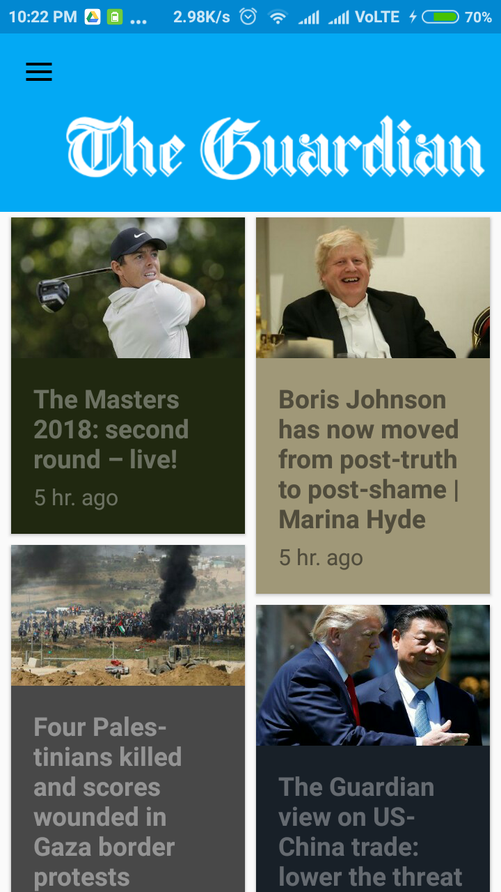
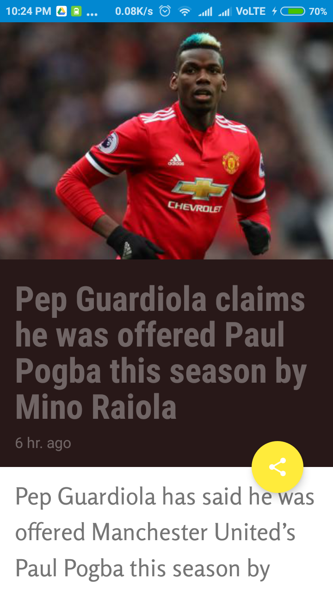

# Material News Reader
Originally **XYZ Reader**, which I had refined as a part of Udacity [Android Developer Nanodegree Program](https://www.udacity.com/course/android-developer-nanodegree-by-google--nd801). 
**I further modified the app to fetch news from The Guardian, instead of (earlier) static articles.**

## Screenshots
<table>
  <tr>
    <td></td>
    <td></td>
    <td></td>
    <td></td>
  </tr>
</table>

## Project Overview
In this project, I redesigned an app to follow the Material Design guidelines and translated a set of static design mocks to a living and breathing app.

I improvised the app for this project:

XYZ Reader: A mock RSS feed reader featuring banner photos and headlines.
The app was functional in the starter code, and worked in most cases for most users.

My job was to take the user feedback in the UI Review node, and implement changes that will improve the UI and make it conform to Material Design.

## Why this Project?
This project gave me an opportunity to improve an app’s design, a vital skill for building apps users will love. It also replicates a common developer task of updating and changing an app's design as new standards are released.

## What Did I Learn?
Through this project, I:
* Understood the fundamentals of Android design.
* Applied Material Design guidelines to an mobile application.
* Separated an interface into surfaces.
* Effectively used transitions and motion.

## User Feedback for XYZ Reader:
(Given with the starter code)

**Lyla says:**
- [x] *“This app is starting to shape up but it feels a bit off in quite a few places. I can't put finger on it but it feels odd.”

**Jay says:**
- [x] *“Is the text supposed to be so wonky and unreadable? It is not accessible to those of us without perfect vision."

**Kagure says:**
- [x] *“The color scheme is really sad and I shouldn't feel sad.”

## Rubric
(Rubric requirements needed to be fulfilled for the project to get accepted)

- [x] App uses the Design Support library and its provided widget types (FloatingActionButton, AppBarLayout, SnackBar, etc).
- [x] App uses CoordinatorLayout for the main Activity.
- [x] App theme extends from AppCompat.
- [x] App uses an AppBar and associated Toolbars.
- [x] App provides a Floating Action Button for the most common action(s).
- [x] App properly specifies elevations for app bars, FABs, and other elements specified in the Material Design specification.
- [x] App has a consistent color theme defined in styles.xml. Color theme does not impact usability of the app.
- [x] App provides sufficient space between text and surrounding elements.
- [x] App uses images that are high quality, specific, and full bleed.
- [x] App uses fonts that are either the Android defaults, are complementary, and aren't otherwise distracting.
- [x] App conforms to common standards found in the [Android Nanodegree General Project Guidelines](http://udacity.github.io/android-nanodegree-guidelines/core.html) .
